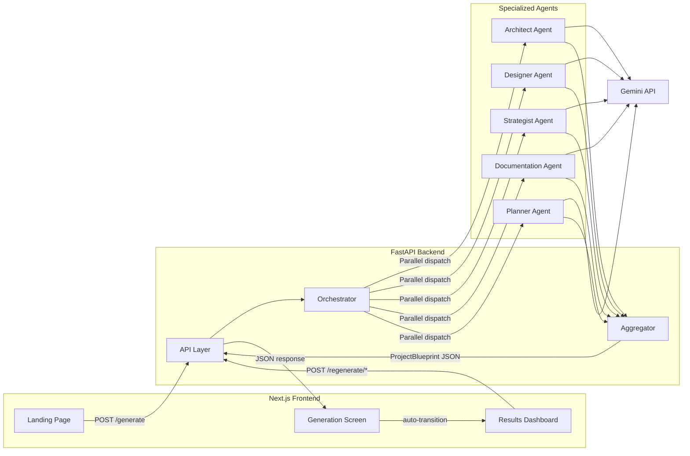
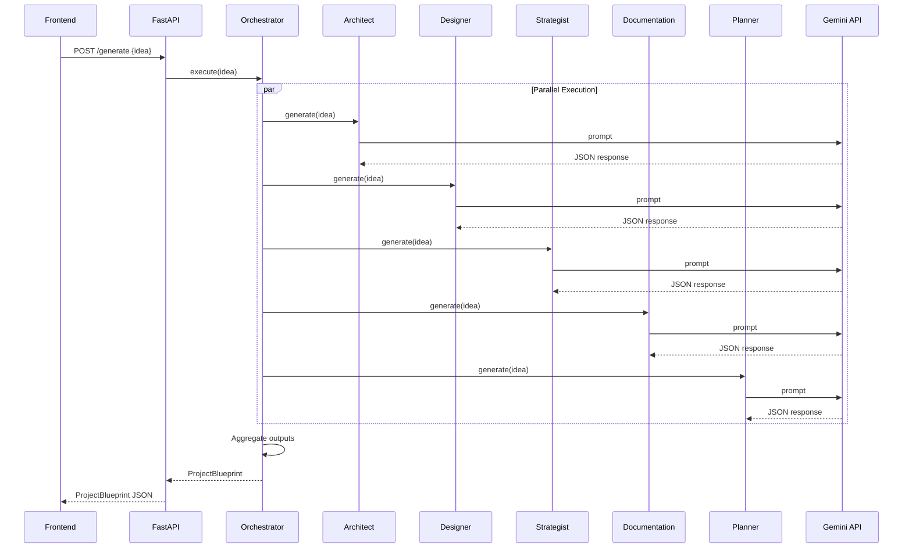

# Orchestra MVP — Implementation Plan

> **Goal**: Build a polished hackathon MVP that transforms a startup idea into an execution-ready blueprint via a multi-agent AI system.

---

## 1. Architecture Overview



### Key Architectural Decisions

| Decision | Choice | Rationale |
|---|---|---|
| Frontend Framework | Next.js + TypeScript | Per spec |
| CSS | TailwindCSS + shadcn/ui | Per spec |
| Backend | FastAPI (Python) | Per spec |
| AI Provider | Gemini API | Per spec |
| State Management | React Context / `useState` | No persistence needed, in-memory only |
| Agent Execution | `asyncio.gather()` (parallel) | Spec prefers parallel execution |
| Database | None | MVP excludes persistence |
| Auth | None | MVP excludes authentication |

---

## 2. Folder Structure

```
ForgeFlow/
├── frontend/                          # Next.js application
│   ├── public/
│   │   └── fonts/                     # Geist, JetBrains Mono
│   ├── src/
│   │   ├── app/
│   │   │   ├── layout.tsx             # Root layout, fonts, metadata
│   │   │   ├── page.tsx               # Landing Page (route: /)
│   │   │   ├── generate/
│   │   │   │   └── page.tsx           # Generation Screen (route: /generate)
│   │   │   └── dashboard/
│   │   │       └── page.tsx           # Results Dashboard (route: /dashboard)
│   │   ├── components/
│   │   │   ├── layout/
│   │   │   │   ├── Navbar.tsx         # Top navigation bar (shared)
│   │   │   │   ├── Sidebar.tsx        # Dashboard sidebar navigation
│   │   │   │   └── Footer.tsx         # Shared footer
│   │   │   ├── landing/
│   │   │   │   ├── HeroSection.tsx    # Hero + idea input textarea
│   │   │   │   ├── AgentCards.tsx     # 4 agent preview cards
│   │   │   │   ├── Features.tsx      # 3-column features section
│   │   │   │   ├── Benefits.tsx      # Benefits + preview image
│   │   │   │   └── CtaSection.tsx    # Bottom CTA block
│   │   │   ├── generation/
│   │   │   │   ├── AgentProgressCard.tsx  # Individual agent progress card
│   │   │   │   ├── OrchestrationHub.tsx   # Central spinner/status hub
│   │   │   │   └── StatusFooter.tsx       # Status bar + cancel button
│   │   │   └── dashboard/
│   │   │       ├── ArchitectureTab.tsx    # Tech Stack, Topology, DB, API, Scalability
│   │   │       ├── WireframesTab.tsx      # Personas, Flows, Screens, Wireframes
│   │   │       ├── DocumentationTab.tsx   # Problem, Vision, Stories, FRs, NFRs
│   │   │       ├── PitchDeckTab.tsx       # Slides: Problem, Solution, Market, etc.
│   │   │       ├── PlanningTab.tsx        # Sprints, Milestones, Timeline, Team
│   │   │       └── RegenerateButton.tsx   # Reusable regeneration control
│   │   ├── lib/
│   │   │   └── api.ts                 # API client (fetch wrappers)
│   │   ├── types/
│   │   │   └── blueprint.ts           # TypeScript types matching ProjectBlueprint
│   │   └── hooks/
│   │       └── useBlueprint.ts        # Blueprint state management hook
│   ├── tailwind.config.ts             # Design tokens from ThemeDesign.md
│   ├── package.json
│   └── tsconfig.json
│
├── backend/                           # FastAPI application
│   ├── app/
│   │   ├── main.py                    # FastAPI app, CORS, route registration
│   │   ├── routes/
│   │   │   ├── generate.py            # POST /generate
│   │   │   └── regenerate.py          # POST /regenerate/{section}
│   │   ├── services/
│   │   │   ├── orchestrator.py        # Orchestrator: dispatches agents, aggregates
│   │   │   └── gemini.py              # Gemini API client wrapper
│   │   ├── agents/
│   │   │   ├── base.py                # Base agent class
│   │   │   ├── architect.py           # Architect Agent
│   │   │   ├── designer.py            # Designer Agent
│   │   │   ├── strategist.py          # Strategist Agent
│   │   │   ├── documentation.py       # Documentation Agent
│   │   │   └── planner.py             # Planner Agent
│   │   ├── models/
│   │   │   ├── request.py             # Request models (GenerateRequest, etc.)
│   │   │   ├── blueprint.py           # ProjectBlueprint Pydantic model
│   │   │   └── agent_outputs.py       # Individual agent output Pydantic models
│   │   └── prompts/
│   │       ├── architect.py            # Architect agent prompt template
│   │       ├── designer.py             # Designer agent prompt template
│   │       ├── strategist.py           # Strategist agent prompt template
│   │       ├── documentation.py        # Documentation agent prompt template
│   │       └── planner.py              # Planner agent prompt template
│   ├── requirements.txt
│   └── .env.example                   # GEMINI_API_KEY placeholder
│
├── orchestra/docs/                    # Existing documentation (read-only)
├── stitch/                            # Existing Stitch assets (read-only)
├── ThemeDesign.md                     # Existing design tokens (read-only)
└── instructions.md                    # Existing build instructions (read-only)
```

---

## 3. API Routes

All endpoints are defined per [claude-build-spec.md](file:///c:/Users/l/OneDrive/Desktop/ForgeFlow/orchestra/docs/claude-build-spec.md#L350-L396). No auth. No persistence.

### 3.1 `POST /generate`

| Field | Detail |
|---|---|
| **Purpose** | Accept a project idea, execute all 5 agents in parallel, return complete `ProjectBlueprint` |
| **Request Body** | `{ "idea": string }` |
| **Response** | Full `ProjectBlueprint` JSON |
| **Flow** | Orchestrator → 5 agents (parallel via `asyncio.gather`) → Aggregator → Response |

### 3.2 `POST /regenerate/architecture`

| Field | Detail |
|---|---|
| **Purpose** | Re-execute Architect Agent only |
| **Request Body** | `{ "idea": string, "current_blueprint": ProjectBlueprint }` |
| **Response** | Updated `ProjectBlueprint` with new `architecture` section; all other sections preserved |

### 3.3 `POST /regenerate/design`

| Field | Detail |
|---|---|
| **Purpose** | Re-execute Designer Agent only |
| **Request Body** | `{ "idea": string, "current_blueprint": ProjectBlueprint }` |
| **Response** | Updated `ProjectBlueprint` with new `design` section; all other sections preserved |

### 3.4 `POST /regenerate/documentation`

| Field | Detail |
|---|---|
| **Purpose** | Re-execute Documentation Agent only |
| **Request Body** | `{ "idea": string, "current_blueprint": ProjectBlueprint }` |
| **Response** | Updated `ProjectBlueprint` with new `documentation` section; all other sections preserved |

### 3.5 `POST /regenerate/pitch-deck`

| Field | Detail |
|---|---|
| **Purpose** | Re-execute Strategist Agent only |
| **Request Body** | `{ "idea": string, "current_blueprint": ProjectBlueprint }` |
| **Response** | Updated `ProjectBlueprint` with new `pitch_deck` section; all other sections preserved |

### 3.6 `POST /regenerate/planning`

| Field | Detail |
|---|---|
| **Purpose** | Re-execute Planner Agent only |
| **Request Body** | `{ "idea": string, "current_blueprint": ProjectBlueprint }` |
| **Response** | Updated `ProjectBlueprint` with new `planning` section; all other sections preserved |

---

## 4. Agent System

### 4.1 Orchestrator Pattern



### 4.2 Agent Responsibilities

Per [orchestra-orchestrator-data-model.md](file:///c:/Users/l/OneDrive/Desktop/ForgeFlow/orchestra/docs/orchestra-orchestrator-data-model.md):

| Agent | Dashboard Tab | Outputs |
|---|---|---|
| **Architect** | Architecture | `tech_stack`, `system_topology`, `database_schema`, `api_design`, `scalability` |
| **Designer** | Wireframes | `personas`, `flows`, `screens`, `wireframes` |
| **Strategist** | Pitch Deck | `problem`, `solution`, `market`, `business_model`, `go_to_market`, `roadmap`, `suggestions` |
| **Documentation** | Documentation | `problem_statement`, `product_vision`, `user_stories`, `functional_requirements`, `non_functional_requirements` |
| **Planner** | Project Planning | `sprint_plan`, `milestones`, `development_timeline`, `team_recommendations` |

### 4.3 Agent Implementation Details

Each agent:
1. Receives the user's idea string
2. Constructs a Gemini prompt that enforces JSON output matching the schema from [orchestra-orchestrator-outputs.md](file:///c:/Users/l/OneDrive/Desktop/ForgeFlow/orchestra/docs/orchestra-orchestrator-outputs.md)
3. Calls the Gemini API with `response_mime_type: "application/json"`
4. Parses the response into a Pydantic model
5. On parse failure: retries up to 2 times, then returns a structured error

### 4.4 Regeneration

For regeneration endpoints:
- Only the targeted agent re-executes
- The `current_blueprint` is passed in the request body
- The orchestrator replaces only the relevant section and returns the updated `ProjectBlueprint`

---

## 5. Data Contracts

All contracts are derived from [orchestra-orchestrator-blueprint.md](file:///c:/Users/l/OneDrive/Desktop/ForgeFlow/orchestra/docs/orchestra-orchestrator-blueprint.md) and [orchestra-orchestrator-outputs.md](file:///c:/Users/l/OneDrive/Desktop/ForgeFlow/orchestra/docs/orchestra-orchestrator-outputs.md).

### 5.1 ProjectBlueprint (Top-Level Response)

```typescript
// TypeScript (frontend) — maps to blueprint.md
interface ProjectBlueprint {
  project: {
    project_id: string;
    project_name: string;
    idea: string;
    generated_at: string;  // ISO timestamp
  };
  architecture: ArchitectOutput;
  pitch_deck: StrategistOutput;
  design: DesignerOutput;
  documentation: DocumentationOutput;
  planning: PlannerOutput;
}
```

### 5.2 Architect Agent Output

```typescript
interface ArchitectOutput {
  tech_stack: {
    frontend: Record<string, string>;  // e.g. { framework: "Next.js", language: "TypeScript" }
    backend: Record<string, string>;
    database: Record<string, string>;
    infrastructure: Record<string, string>;
  };
  system_topology: {
    nodes: string[];
    connections: string[];
  };
  database_schema: {
    tables: string[];
  };
  api_design: {
    endpoints: Array<{
      method: string;
      path: string;
      purpose: string;
    }>;
  };
  scalability: {
    scaling: string;
    caching: string;
    infrastructure: string;
  };
}
```

### 5.3 Strategist Agent Output (Pitch Deck)

```typescript
interface StrategistOutput {
  problem: {
    headline: string;
    summary: string;
    pain_points: string[];
  };
  solution: {
    headline: string;
    summary: string;
    key_features: string[];
  };
  market: {
    market_size: string;
    target_users: string[];
    trends: string[];
  };
  business_model: {
    revenue_streams: string[];
    pricing: string;
  };
  go_to_market: {
    channels: string[];
    acquisition_strategy: string;
  };
  roadmap: {
    phase_1: string;
    phase_2: string;
    phase_3: string;
  };
  suggestions: Array<{
    title: string;
    description: string;
  }>;
}
```

### 5.4 Designer Agent Output (Wireframes)

```typescript
interface DesignerOutput {
  personas: Array<{
    name: string;
    role: string;
    goals: string[];
  }>;
  flows: Array<{
    name: string;
    steps: string[];
  }>;
  screens: Array<{
    name: string;
    purpose: string;
  }>;
  wireframes: Array<{
    screen: string;
    components: string[];
  }>;
}
```

### 5.5 Documentation Agent Output

```typescript
interface DocumentationOutput {
  problem_statement: {
    title: string;
    summary: string;
    challenges: string[];
  };
  product_vision: {
    vision_statement: string;
    mission: string;
    success_metrics: string[];
  };
  user_stories: Array<{
    actor: string;
    goal: string;
    benefit: string;
  }>;
  functional_requirements: Array<{
    id: string;
    title: string;
    description: string;
  }>;
  non_functional_requirements: Array<{
    category: string;
    requirement: string;
  }>;
}
```

### 5.6 Planner Agent Output

```typescript
interface PlannerOutput {
  sprint_plan: Array<{
    sprint_name: string;
    duration: string;
    objectives: string[];
    deliverables: string[];
  }>;
  milestones: Array<{
    name: string;
    description: string;
    target_date: string;
  }>;
  development_timeline: Array<{
    phase: string;
    duration: string;
    goals: string[];
  }>;
  team_recommendations: Array<{
    role: string;
    responsibilities: string[];
  }>;
}
```

---

## 6. Screen Inventory (from Stitch)

The application has **3 primary screens** and **5 dashboard tabs**. Each is faithfully derived from the Stitch exports.

### 6.1 Landing Page (`/`)
- **Source**: [landing page HTML](file:///c:/Users/l/OneDrive/Desktop/ForgeFlow/stitch/multi_agent_hackathon_builder_landing_page/code.html) + [screenshot](file:///c:/Users/l/OneDrive/Desktop/ForgeFlow/stitch/multi_agent_hackathon_builder_landing_page/screen.png)
- **Sections**: Navbar → Hero (status badge, headline, subtitle, textarea + Generate Blueprint button, trusted-by logos) → Agent Cards (4 cards in grid) → Features (3-column) → Benefits (2-column with preview image) → CTA → Footer
- **Key Interaction**: Textarea input → "Generate Blueprint" button → navigates to `/generate`

### 6.2 Generation Screen (`/generate`)
- **Source**: [generation HTML](file:///c:/Users/l/OneDrive/Desktop/ForgeFlow/stitch/generation-transition/code.html) + [screenshot](file:///c:/Users/l/OneDrive/Desktop/ForgeFlow/stitch/generation-transition/screen.png)
- **Layout**: Full-page, centered. Navbar → Header → 3×2 grid of agent progress cards → orchestration hub card (spinner) → status footer + cancel button
- **5 Agent Cards**: Architecture Agent, UI Agent, Documentation Agent, Pitch Deck Agent, Project Planner Agent — each with progress bar, status badge, and activity text
- **Orchestration Hub**: Central spinner with estimated completion time
- **Behavior**: Polls or waits for `/generate` response → auto-transitions to `/dashboard`

### 6.3 Results Dashboard (`/dashboard`)
- **Layout**: Sidebar (left, fixed 240-280px) + Main content area
- **Sidebar nav items**: Overview/Dashboard, Architecture, Wireframes, Documentation, Pitch Deck, Project Planning
- **Each tab** renders the corresponding section of the `ProjectBlueprint`

#### 6.3.1 Architecture Tab
- **Source**: [architecture HTML](file:///c:/Users/l/OneDrive/Desktop/ForgeFlow/stitch/architecture_blueprint_view/code.html) + [screenshot](file:///c:/Users/l/OneDrive/Desktop/ForgeFlow/stitch/architecture_blueprint_view/screen.png)
- **Layout**: Bento grid with cards: Tech Stack (col-4), System Topology SVG diagram (col-8), Database Schema (col-6), API Endpoints table (col-6), Scalability (col-12)
- **Action buttons**: Export Spec, Regenerate

#### 6.3.2 Wireframes Tab
- **Source**: [wireframes HTML](file:///c:/Users/l/OneDrive/Desktop/ForgeFlow/stitch/product_wireframes_view/code.html) + [screenshot](file:///c:/Users/l/OneDrive/Desktop/ForgeFlow/stitch/product_wireframes_view/screen.png)
- **Sections**: User Flow Diagram (flow nodes), Screen List (numbered list with status badges), Mobile Wireframe placeholders, Web Wireframe bento grid
- **Sidebar sub-nav**: Workspace items (Dashboard, Wireframes, Style Guide, Assets), Active Flows list

#### 6.3.3 Documentation Tab
- **No dedicated Stitch HTML** (screen.png is a 28-byte placeholder)
- Build using same card-based layout pattern as Architecture tab
- Sections: Problem Statement card, Product Vision card, User Stories list, Functional Requirements table, Non-Functional Requirements table

#### 6.3.4 Pitch Deck Tab
- **Source**: [pitch deck HTML](file:///c:/Users/l/OneDrive/Desktop/ForgeFlow/stitch/pitch_deck_generator_view/code.html) + [screenshot](file:///c:/Users/l/OneDrive/Desktop/ForgeFlow/stitch/pitch_deck_generator_view/screen.png)
- **Layout**: 3-panel — Left sidebar (slide navigator thumbnails), Center (slide preview canvas), Right panel (AI Suggestions)
- **Slides**: Problem, Solution, Market, Business Model, Roadmap, Team/Suggestions (6 slides)
- **Action buttons**: Share, Export PPT, Regenerate

#### 6.3.5 Project Planning Tab
- **No dedicated Stitch HTML** (screen.png is a 28-byte placeholder)
- Build using same card-based layout pattern
- Sections: Sprint Plan (timeline/cards), Milestones (timeline), Development Timeline, Team Recommendations

---

## 7. Design System

Derived from [ThemeDesign.md](file:///c:/Users/l/OneDrive/Desktop/ForgeFlow/ThemeDesign.md) and the Stitch Tailwind configs:

| Token | Value |
|---|---|
| **Background** | `#000000` (canvas) / `#131313` (surface) |
| **Surface L1** | `#0a0a0a` (cards, sidebars) |
| **Surface L2** | `#171717` + 1px `#262626` border |
| **Primary** | `#adc6ff` (Electric Blue) |
| **Secondary** | `#ddb7ff` (Deep Purple) |
| **Tertiary** | `#ffb786` (Orange accent) |
| **On-Surface** | `#e5e2e1` |
| **On-Surface-Variant** | `#c2c6d6` |
| **Border** | `#262626` |
| **Font: Display** | Geist, 48px, 700, -0.04em tracking |
| **Font: Headline LG** | Geist, 32px, 600, -0.02em tracking |
| **Font: Body** | Geist, 16px/14px, 400 |
| **Font: Code/Labels** | JetBrains Mono, 12px, 450 |
| **Glassmorphism** | `backdrop-blur: 12px`, `bg: #0a0a0a/70%` |
| **Border Radius** | Components: 4px, Cards: 8px |

---

## 8. Open Questions

> [!IMPORTANT]
> **Gemini API Key**: The backend needs a `GEMINI_API_KEY` environment variable. Do you have one ready, or should I use a placeholder `.env.example`?

> [!IMPORTANT]
> **Gemini Model**: Which Gemini model should I use? Recommended: `gemini-2.0-flash` for speed (hackathon), or `gemini-2.5-pro` for quality. Default will be `gemini-2.0-flash`.

> [!NOTE]
> **Documentation & Planning tabs**: These two dashboard tabs have no Stitch HTML exports (their `screen.png` files are 28-byte placeholders). I will design them using the same card/bento-grid patterns from the Architecture tab to maintain visual consistency. Please confirm this approach is acceptable.

> [!NOTE]
> **Export functionality**: The PRD mentions export (Markdown, PDF, PPTX, JSON, Mermaid). The MVP build spec does not list it as a required endpoint. I plan to **skip export for MVP** unless you want a basic JSON download. Please confirm.

---

## 9. Verification Plan

### Automated Tests
- `cd backend && python -m pytest` — test agent output parsing, orchestrator aggregation, API routes
- `cd frontend && npm run build` — verify TypeScript compiles with no errors

### Manual Verification
1. Start backend: `cd backend && uvicorn app.main:app --reload`
2. Start frontend: `cd frontend && npm run dev`
3. Enter an idea on the landing page
4. Verify generation screen shows agent progress animation
5. Verify dashboard populates with all 5 tab sections
6. Verify each regenerate button only refreshes its section
7. Visually compare each screen against Stitch screenshots
